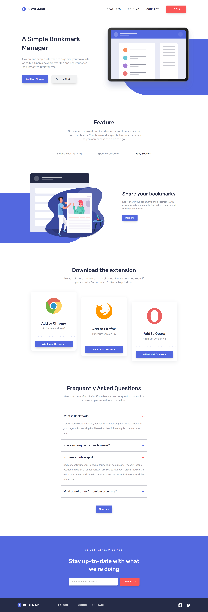
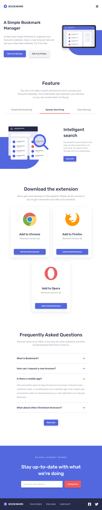
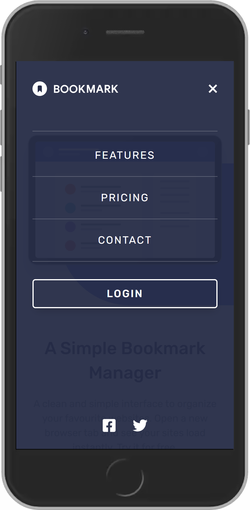
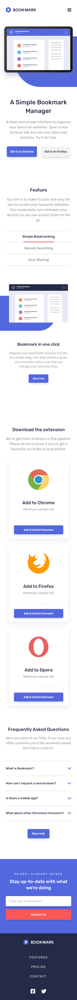

# Frontend Mentor Challenge - Bookmark landing page solution

This is a solution to the [Bookmark landing page challenge on Frontend Mentor](https://www.frontendmentor.io/challenges/bookmark-landing-page-5d0b588a9edda32581d29158). Frontend Mentor challenges.

## Table of contents

- [Overview](#overview)
  - [The challenge](#the-challenge)
  - [Screenshot](#screenshot)
  - [Links](#links)
- [My process](#my-process)
  - [Built with](#built-with)
- [Author](#author)

## Overview

### The challenge

Users should be able to:

- View the optimal layout for the site depending on their device's screen size
- See hover states for all interactive elements on the page
- Receive an error message when the newsletter form is submitted if:
  - The input field is empty
  - The email address is not formatted correctly

### Screenshot

#### Desktop View

#### Tab View

#### Mobile Navigation

#### Mobile View

### Links

- Live Site URL: [Add live site URL here](https://bookmark-frontend-mentor-ed.netlify.app/)

## My process

### Built with

- Semantic HTML5 markup
- CSS custom properties
- Flexbox
- CSS Grid
- Mobile-first workflow
- Vanilla JS

## Author

- Frontend Mentor - [@shaj-ed](https://www.frontendmentor.io/profile/shaj-ed)
- Twitter - [@ShajedArrgh](https://twitter.com/ShajedArrgh)
